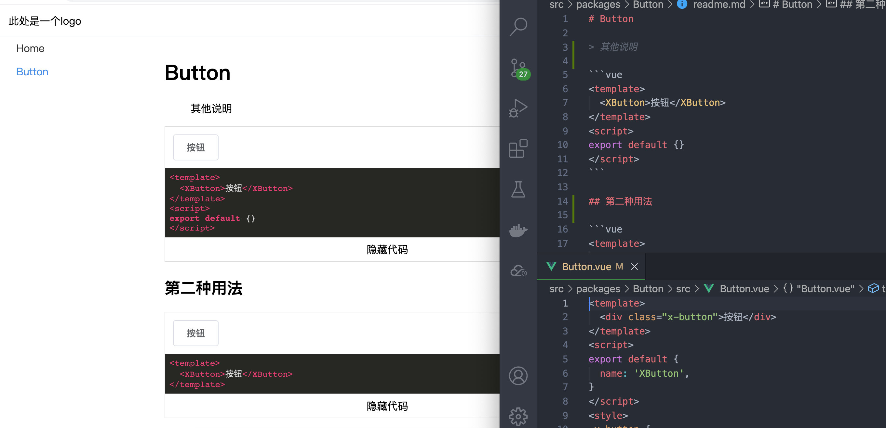

# vue3组件库开发



> 根据在每个组件库的根目录的readme生成带在线组件预览的文档

## todo

- 根据markdown生成文档
  - 渲染代码块为vue的部分
  - 代码高亮
- 打包
- 测试
- lerna

## 后期

### 目录结构

```
src 源代码
  packages  开发目录
    button  按钮组件
      __tests__ 测试目录
      src           源代码
        index.ts    组件入口
      readme.md     文档及示例
      package.json  
  main.ts           项目主入口
  lerna.json
  package.json      项目package.json
  vite.config.ts    vite配置文件
```


```ts
import XUI from './packages/x-ui'
import bootstrap, { Modules } from 'xz-component-doc';

const modules = import.meta.glob('./packages/**/readme.md');
const app = bootstrap(modules as any as Modules);

app.use(XUI);
```

## vite.config.ts

```ts
import { defineConfig } from 'vite';
import vue from '@vitejs/plugin-vue';
import markdownToVue from './src/markdown-to-vue/src/index';

// https://vitejs.dev/config/
export default defineConfig({
  plugins: [
    markdownToVue(),
    // 需要增加这个
    vue({ include: [/\.vue$/, /\.md$/, /\.vd$/] })
  ]
});
```
